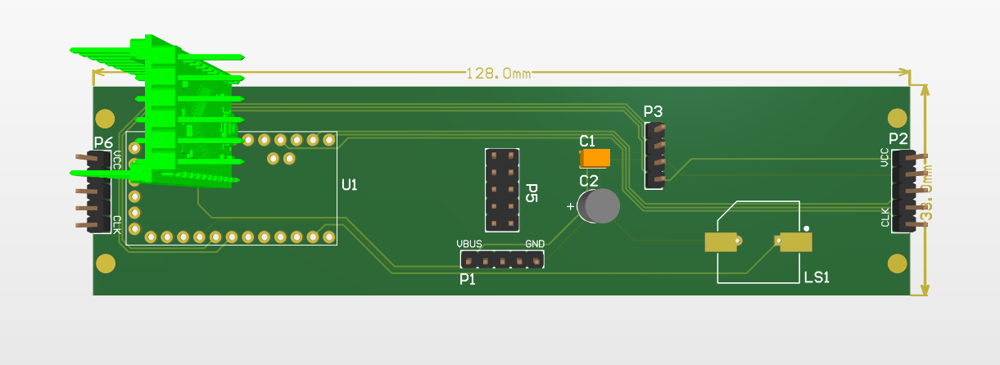
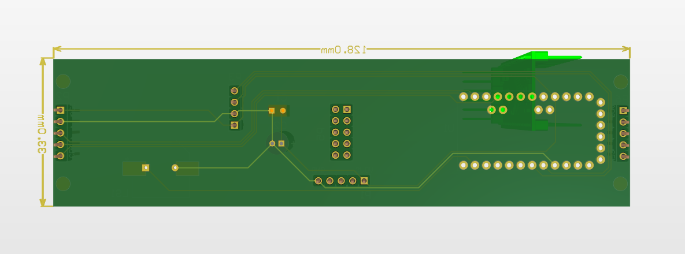
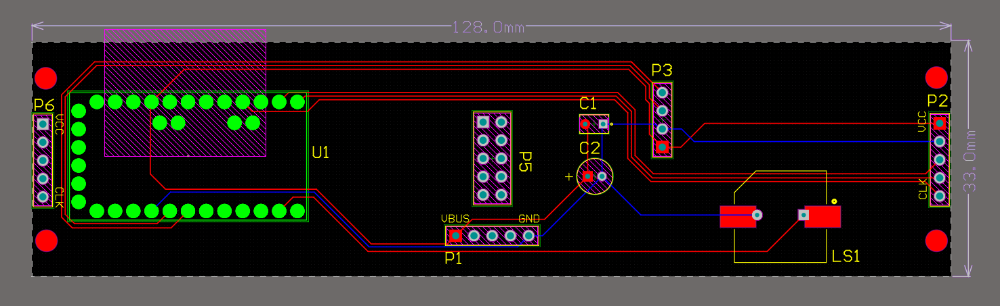
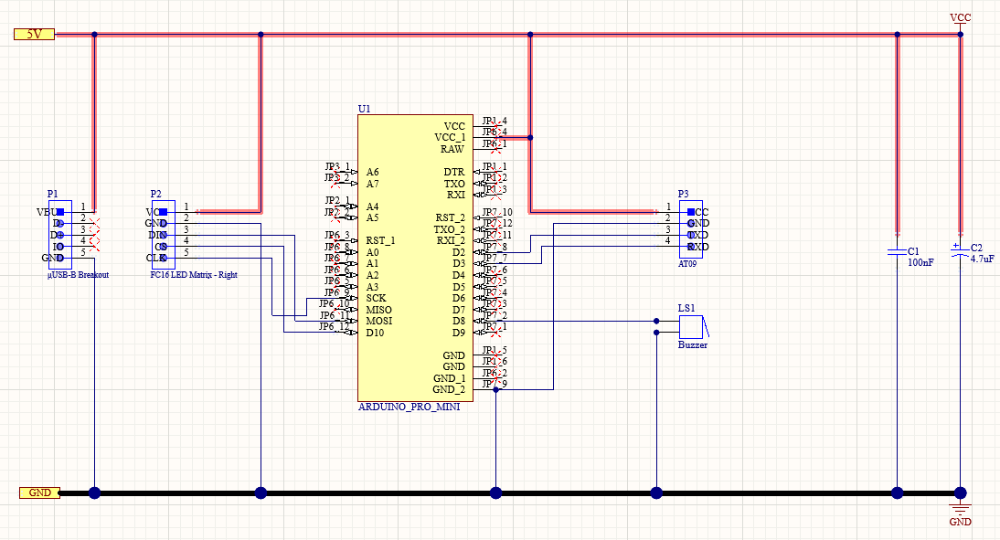
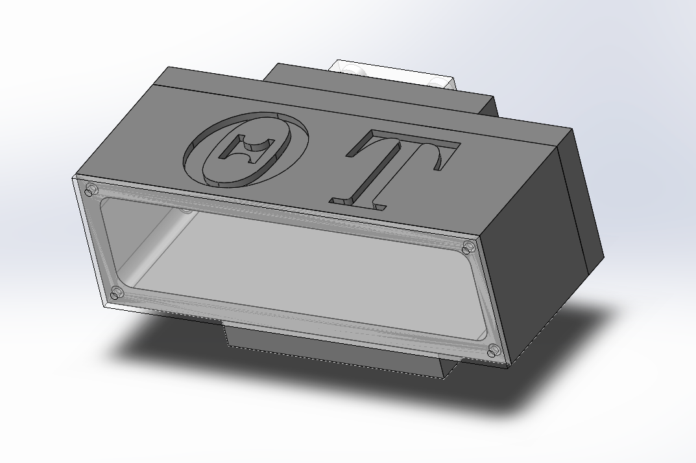

# Theta Tau App Delta Pledge Class Technical Project Electronics
Electronics repository of the Delta Pledge Class. This repository includes the firmware of the embedded system and files for the Altium Designer PCB.

## Project Demo
### Video Demonstration

### Altium PCB & Schematics

 

 

 

 

### SolidWorks Electronics Enclosure
Courtesy of the Hardware Committee :) 

 

## Electronics Committee
_Vincent Saw_ - Project Director, Electronics Lead, Firmware & Hardware Engineer - LED matrix, Bluetooth LE, PCB 
Anthony Lal - Firmware & Hardware Engineer - Bluetooth LE 

## Quick Links
[Gantt Chart and Consolidated Sheet](https://docs.google.com/spreadsheets/d/1VhCbg1d47hBmEg20Uc_-arUAMw05hEPBOkWhSjltqOU/edit#gid=574701751) 
[Project Presentation](https://docs.google.com/presentation/d/1MC0XHRqNYXeY45uN3Q5Jt8sAotjQurosrFn7ysKqrGg/edit?usp=sharing) 

## Getting Started with Git & GitHub

### Installing Git and Planning Your Environment
1. Start by forking the repo (top right of the page). This will create a copy of the main repository on your GitHub account. 
You can find this respository by navigating to your own GitHub page. This forked repo will be your main repo for you to develop on this project. 
To merge your updates into the main branch, simply create a pull request via your forked repo. This will allow the project managers to review your submitted code before it merges into the main project repository.
2. Install the desktop git client if you do not have it already ([Git Download](https://git-scm.com/downloads) or `sudo apt install git` on Ubuntu). You can see if your git is working properly by simply typing `git` in your terminal (Git bash/MinGW on Windows)
3. Choose the folder/directory where you would like to work in (where your local repo will be stored). You can do this by typing `cd YOUR_PREFERRED_DIRECTORY` in your terminal
4. Now that you are in your preferred working directory, clone your forked repo by running `git clone https://github.com/YOUR_GITHUB_USERNAME/delta-electronics` in your terminal.

### Fetching the Latest Main Repo Updates
To be able to pull the latest updates from the main project repository into your local directory, run `git remote add upstream https://github.com/sjsu-tt-delta/delta-electronics.git`.  
**Every time you want to pull the latest updates from the main project repository, run `git pull upstream main`.**
